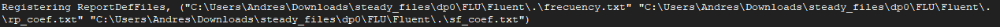

# 🌊 Fluid Mechanics II Laboratory Repository

This repository contains the laboratory sessions for **Fluid Mechanics II** in the **Aerospace Engineering program** at Universidad Carlos III de Madrid (UC3M). It includes practical exercises, experimental data, MATLAB codes, and related materials designed to complement theoretical concepts with hands-on learning.

---

## 📑 Table of Contents
1. [Repository Structure](#-repository-structure)
2. [Project Descriptions](#-project-descriptions)
   - [Flow over a cylinder. Part I](#1-flow-over-a-cylinder-part-i-numerical-analysis-with-ansys-fluent)

3. [How to Use](#-how-to-use)
4. [Requirements](#%EF%B8%8F-requirements)
5. [Download as .zip](#-download-as-zip)
6. [Authors](#-authors)
7. [Course Information](#-course-information)
8. [Contribution](#-contribution)
9. [License](#-license)

---

## 📁 Repository Structure

```
.
├── Flow over a cylinder, Part 1/
│   ├── fluent/                  # ANSYS simulation files
│   ├── matlab/                   # MATLAB analysis scripts
│   ├── images/                  # images simulation data
│   ├── videos/                  # videos simulation data
│   └── Flow around an Airfoil.pdf

```

## 📂 Project Descriptions

### 1. Flow over a cylinder. Part I: Numerical analysis with Ansys Fluent

This lab aims to numerically investigate the flow over a circular cylinder using the CFD software **Ansys Fluent**. The main objectives are:

- To study the effect of the **Reynolds number** on the flow behavior.
- To reproduce and analyze the **von Kármán vortex street**.
- To identify and visualize different flow regimes (laminar, transitional, and turbulent).
- To examine flow characteristics such as **vorticity**, **pressure and friction coefficients**, and **boundary layer separation**.
- To develop proficiency in setting up and analyzing **CFD simulations** of external flows.

Through this lab, students will connect theoretical fluid mechanics concepts with practical numerical simulations to better understand bluff body aerodynamics.

#### Steps to Run the Simulation (All the rest is already set up)

1. **Open the project files (`*.wbpz`)** in Ansys Workbench and immediately click **"Save As"** to escape from archive mode and create a (`*.wbpj` and  a `*steady_file` or `*transient_file`) 

<p align="center">
  
</p>

2. **Right-click on "Setup"** and choose **"Edit"** to access the simulation settings.
3. In the **General** settings, select **"Double Precision"** and set the **number of cores to 4**.
4. Go to **Boundary Conditions** and update the **inlet velocity** as needed. Make sure the velocity is also updated in the **Reference Values**.
5. **Initialize** the solution and click **"Run Calculation"** to start the simulation.
6. For both **steady and transient** simulations, the files for **pressure coefficient**, **skin friction coefficient**, and **oscillation frequency** will be saved in the directory shown in the **console output** .
<p align="center">
  
</p>

7. Generate the **vorticity contour plots** and **pathlines for streamlines** to visualize the flow.
8. For **transient simulations**, the vorticity snapshots are saved in the same folder as for the **pressure coefficient**, **skin friction coefficient**, and **oscillation frequency**. These images can be combined into an animation using the provided `join.m` script.

## 🚀 How to Use
1. Clone the repository:
   ```bash
   git clone https://github.com/Himalia13/Fluid-Mechanics-II-Laboratory-Sessions-from-Aerospace-Engineering-UC3M
   ```
2. Navigate to the project of interest and open the .m files in MATLAB to run the simulations.

3. Review the PDFs to understand the theoretical framework and the results of each simulation.

4. Each laboratory session contains:
- A PDF report with theoretical background, methodology, and results
- Source code for data analysis and visualization
- Raw experimental data or simulation files
- Additional documentation specific to each experiment

## 🛠️ Requirements

- MATLAB (for data analysis and plotting)
- ANSYS Fluent (for airfoil simulations)

## 📦 Download as .zip
If you prefer, you can download the entire repository as a .zip file:

1. Visit the repository page in GitHub.
2. Click the green **Code** button.
3. Select **Download ZIP** and extract the contents to your local directory.


## 👥 Authors

Different laboratory sessions were completed by various student groups from the Aerospace Engineering program at UC3M, including:
- Jon Castillo Altube
- Diego Delgado Madrigal
- Lidia Mena Cardena
- Andrés Velázquez Vela


## 📘 Course Information

- **Institution**: Universidad Carlos III de Madrid (UC3M)
- **Program**: Aerospace Engineering
- **Course**: Fluid Mechanics II
- **Academic Year**: 2024

## 🤝 Contribution
Contributions are welcome. If you want to add or improve a simulation, create a pull request or open an issue to discuss it.

## 📄 License
This project is free to use, modify, and distribute without restrictions.

# Fluid-Mechanics-II-Laboratory-Sessions-from-Aerospace-Engineering
